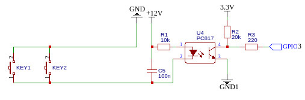
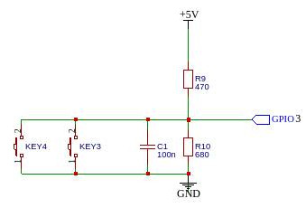

## wifi_socket
WiFi-реле, построенное на основе **esp8266** или **esp32**.

- [Количество реле, подключенных к модулю](#количество-реле-подключенных-к-модулю)
- [Подключение локальных кнопок](#подключение-локальных-кнопок)
- [Обновление прошивки](#обновление-прошивки)
- [Использованные сторонние библиотеки](#использованные-сторонние-библиотеки)


### Количество реле, подключенных к модулю
Количество реле, подключаемых к модулю, зависит от количества свободних пинов, которые могут выступать к качестве выходов Однако, следует иметь в виду, что при использовании Web-интерфейса и, соответственно, сохранения настроек кнопок в файловой системе модуля, количество реле ограничивается восемью. Для большего количества корректное сохранение настроек не гарантируется.

Реле, подключенные к модулю, описываются в массиве `relays[]`, их количество указывается в константе `reley_count`. И то, и другое расположено в файле **header_file.h** в блоке 
```
// ==== SRControl ====================================
```

В текущем варианте - это двухрелейный модуль.

### Подключение локальных кнопок

Для удобства управления модулем к нему можно подключать локальные кнопки. Если предполагается, что кнопки будут располагаться на самом модуле, можно обойтись простым подключением
```
GND -> btn <- GPIO4
```
Но, если необходимо вынести кнопки на расстояние (например, организовать несколько точек с кнопками в разных местах комнаты), то для обеспечения помехоустойчивости, лучше сделать одним из нижеследующих вариантов:

- вариант с гальванической развязкой



GND и GND1 между собой соединяться не должны.

- вариант без гальванической развязки



В обоих случаях можно использовать несколько кнопок, соединенных параллельно - нажатие на любую из них будет приводить к одному результату. В качестве проводов лучше использовать витую пару, вынутую из кабеля UTP.

### Обновление прошивки

В модуле есть возможность обновления прошивки "по воздуху" с использованием Web-интерфейса. Доступ к интерфесу обновления выполняется по адресу "/firmware", однако адрес можно изменить в функции `server_init()` в файле **header_file.h**
```
// настройка сервера обновлений
httpUpdater.setup(&HTTP, "/firmware");
```

В интерфейсе обновления нужно выбрать файл с новой прошивкой, нажать на кнопку **Update firmware** и дождаться результата.

### Использованные сторонние библиотеки

- [hSRControl](https://github.com/VAleSh-Soft/shSRControl) - работа с релейными модулями;
- [shWiFiConfig](https://github.com/VAleSh-Soft/shWiFiConfig) - настройка параметров WiFi-соединения;
- [shButton](https://github.com/VAleSh-Soft/shButton) - работа с тактовыми кнопками;
- [ArduinoJson](https://github.com/bblanchon/ArduinoJson) (не ниже версии 6.0) - работа с текстом в формате JSON;

<hr>

Если возникнут вопросы, пишите на valesh-soft@yandex.ru 
