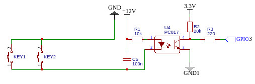
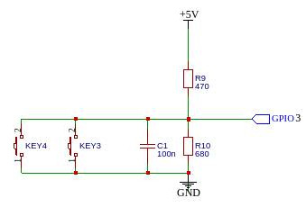

## wifi_switch
WiFi-выключатель, построенный на основе **esp8266** или **esp32**.

- [Количество удаленных реле, привязанных к модулю](#количество-удаленных-реле-привязанных-к-модулю)
- [Подключение кнопок](#подключение-кнопок)
- [Файловая система](#файловая-система)
- [Обновление прошивки](#обновление-прошивки)
- [Подключение периферии](#подключение-периферии)
- [Использованные сторонние библиотеки](#использованные-сторонние-библиотеки)


### Количество удаленных реле, привязанных к модулю

Количество кнопок, подключаемых к модулю, зависит от количества свободных пинов, которые могут выступать к качестве входов и имеют внутреннюю подтяжку **PULLUP**. 

***Примечание**: не каждое удаленное реле, привязанное к модулю, должно иметь собственную кнопку на модуле. В этом случае такое реле может управляться с помощью Web-интерфейса.*

Однако, следует иметь в виду, что при использовании Web-интерфейса и, соответственно, сохранения настроек привязанных к модулю удаленных реле в файловой системе модуля, их количество лучше ограничить восемью. Для большего количества корректное сохранение настроек не гарантируется.

Пины для подключения кнопок задаются в файле `header_file.h`.

Удаленные реле, привязанные к модулю, задаются с помощью метода `addRelay()` в `setup()`.

В текущем варианте - это четырехканальный модуль. В моем случае он управляет сразу тремя релейными модулями - одним двухрелейным ("умный" сетевой удлинитель) и двумя однорелейными, построенными на **esp-01** (верхний свет в комнате и розетка телевизора).

### Подключение кнопок

Если предполагается, что кнопки будут располагаться на самом модуле, можно обойтись простым подключением
```
GND -> btn <- GPIO4
```
Но, если необходимо вынести кнопки на расстояние (например, организовать несколько точек с кнопками в разных местах комнаты), то для обеспечения помехоустойчивости, лучше сделать одним из нижеследующих вариантов:

- вариант с гальванической развязкой



GND и GND1 между собой соединяться не должны.

- вариант без гальванической развязки



В обоих случаях можно использовать несколько кнопок, соединенных параллельно - нажатие на любую из них будет равнозначно. В качестве проводов лучше использовать витую пару, вынутую из кабеля UTP.

### Файловая система

В файловой системе модуля сохраняются конфигурационные файлы, нужные для его работы.

Выбор, инициализация и первичное форматирование файловой системы делается в файле **shFS.h**.

По умолчанию тип файловой системы автоматически выбирается в зависимости от используемого МК: для **ESP32** используется **FFat**, для **ESP8266** - **LittleFS**. Однако, в обоих случаях можно использовать старую файловую систему **SPIFFS**, для этого в файле **header_file.h** нужно раскомментировать строку `#define USE_SPIFFS`.

Для **ESP32** в опциях платы нужно выбрать в **Partition cheme** схему **Default 4MB with ffat** для **FFat** или **Default 4MB with spiffs** для **SPIFFS**; если у вас плата с 16 Мб флеша, то нужно выбирать соответствующую опцию.

Для **ESP8266** используется файловая система **LittleFS**, в опциях платы ничего дополнительно выбирать не нужно

В случае **ESP32** форматирование файловой системы выполняется автоматически при  самом первом запуске или при первом запуске после изменения типа файловой системы; после форматирования модуль автоматически перезагружается;

### Обновление прошивки

В модуле есть возможность обновления прошивки "по воздуху" с использованием Web-интерфейса. Доступ к интерфесу обновления выполняется по адресу "/firmware", однако адрес можно изменить в функции `server_init()` в файле **header_file.h**
```
// настройка сервера обновлений
httpUpdater.setup(&HTTP, "/firmware");
```
Дополнительно в этом методе можно задать логин и пароль для доступа к интерфейсу обновления.

В интерфейсе обновления нужно выбрать файл с новой прошивкой, нажать на кнопку **Update firmware** и дождаться результата.

### Подключение периферии

Пины для подключения кнопок и прочей периферии указаны в файле **header_file.h**

### Использованные сторонние библиотеки

- [shSRControl](https://github.com/VAleSh-Soft/shSRControl) - работа с релейными модулями;
- [shWiFiConfig](https://github.com/VAleSh-Soft/shWiFiConfig) - настройка параметров WiFi-соединения;
- [ArduinoJson](https://github.com/bblanchon/ArduinoJson) (код писался с использованием версии 6.21.3) - работа с текстом в формате JSON;

<hr>

Если возникнут вопросы, пишите на valesh-soft@yandex.ru 
